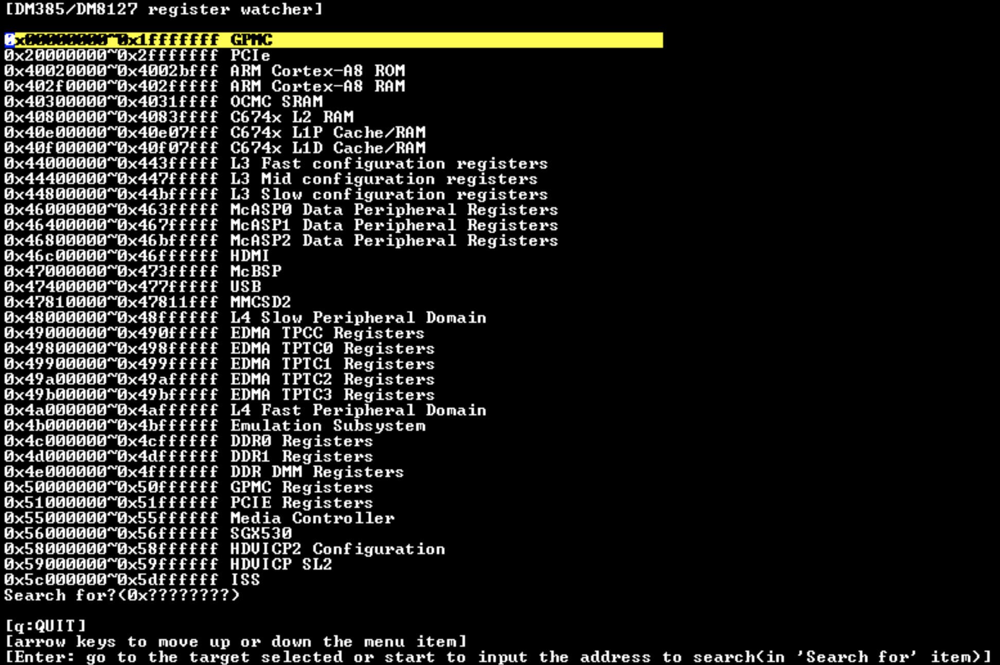
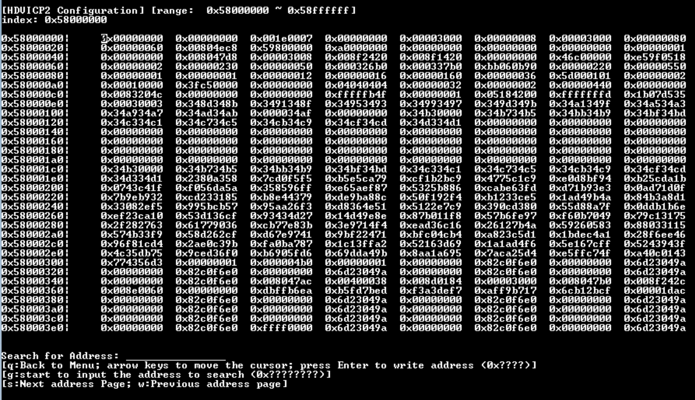

# TI Register Watcher
#### Introduction
* this tool can monitor the register value in real time.

#### Compiling
* This shoud compile on arm-none-linux-gnueabi-gcc compiler and run on TI soc platform.

#### Example

